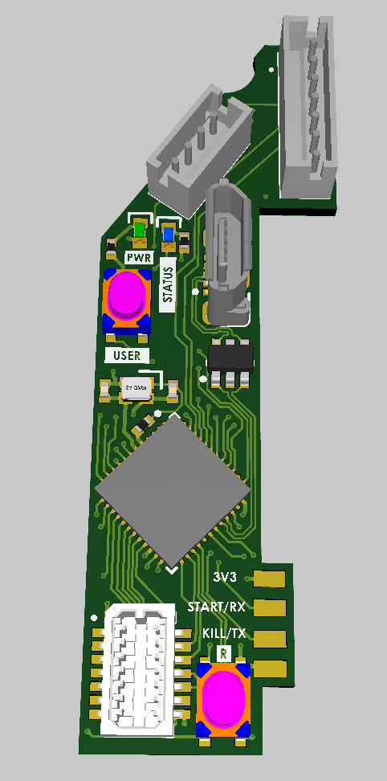
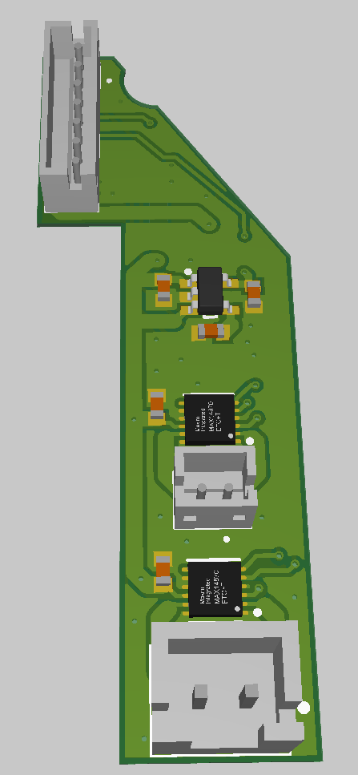
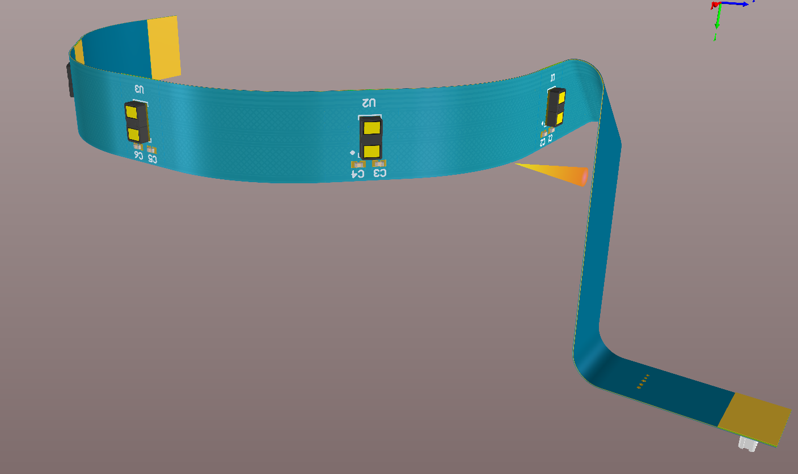
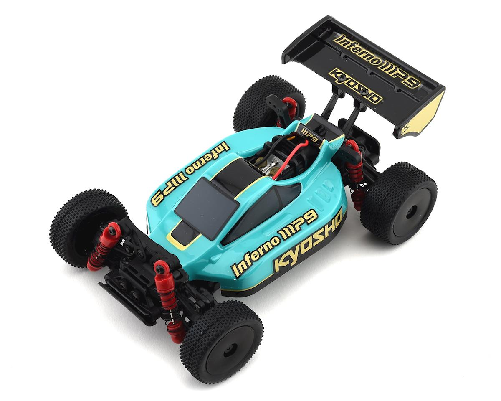
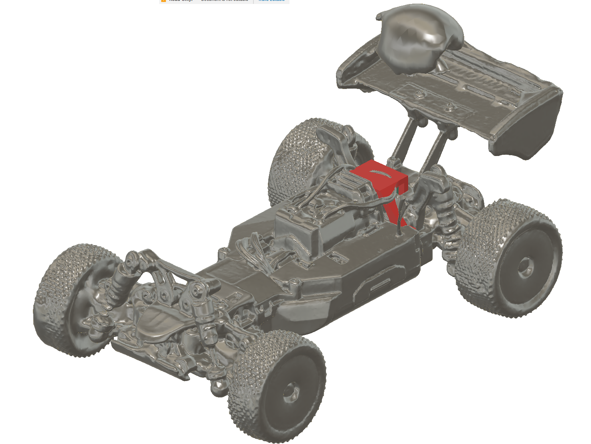

# Donatello - Folkrace car
Donatello is/to be a autonomous little RC car that is going to compete in RobotSM 2023 in the category Folkrace.

## Idea
Use the RC car *Kyosho Mini-Z Buggy*, replacing PCBs for custom control and adding lidar module (custom) for sensing enviroment.W

## Project structure
- **firmware**: Firmware running on STM32F411 MCU
- **hardware**: , CAD files, RC car info
- **PCB**: PCB design 
- **matlab**: Algorithm development, data aquisition

## Development ideas
During this project I have set some goals to learn in different categories:
- Hardwre:
  - Lidar
  - USB Virtual com port
- Algorithms:
  - Object detection with Lidar
  - Object avoidance with lidar
- Development tools
  - CLI on MCU
  - Trying out building, testing and compiling via Github Actions
    - cmake
    - cppcheck
    - clang-format

## PCB
Designed to be drop in replacement of PCBs of *Kyosho Mini-Z Buggy* PCBs and custom solid state lidar.
Consists of 3 PCBs:
1. MCU board: STM32F411, USB, Extra UART, Encoder, 6 Layer
2. AUX board: Motor, Power board, 2 layer
3. Lidar board: 5x ST VL53L1X sensors on flex pcb
4. 
*TODO - Add Gerbers :\)*

### MCU Board

### AUX Board:

### Lidar Board:

## RC Car
Kyosho Mini-Z Buggy

### 3D Scan
To design encoder mount to fit on the existing car I made a 3D scan to check fit.

